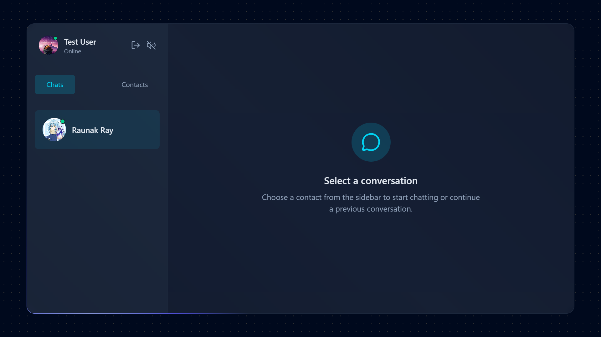
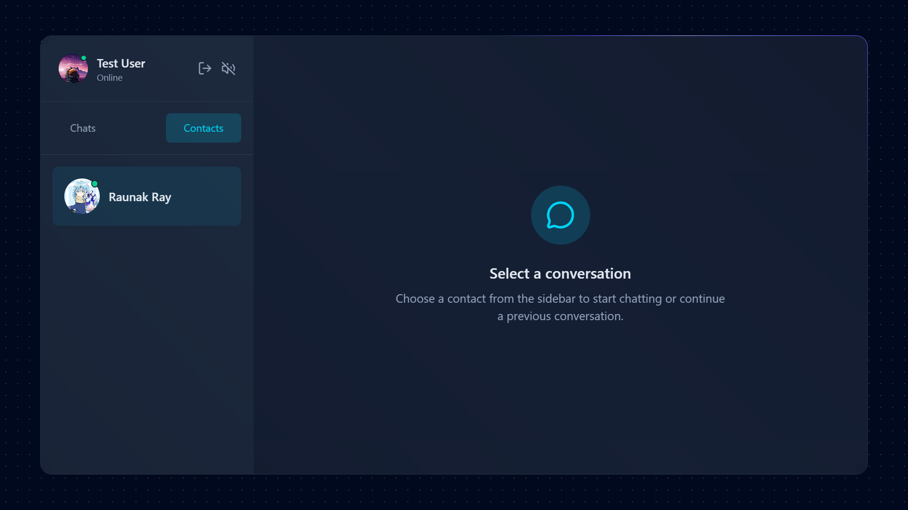
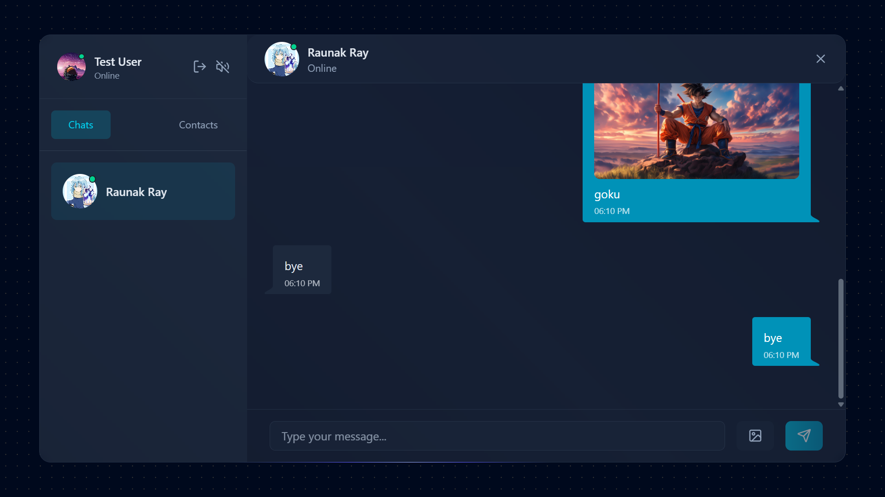

# Chatty – Real-Time Chat Application

Chatty is a full-stack **real-time messaging application** built using the **MERN stack** and **Socket.IO**, enabling instant bidirectional communication between users with secure authentication and modern UI.

## Live Demo

https://chatty-832r.onrender.com

## Demo

<video src="demo/demoVideo.mp4" autoplay muted loop playsinline width="800"></video>

## Screenshots

### Login
</img>

### Sign Up
</img>

### Chat Page
</img>

### Contacts Page
</img>

### Real Chats
</img>


## Features

- Real-time messaging using Socket.IO
- Secure authentication with JWT
- Password hashing with bcrypt
- Media/image uploads with Cloudinary
- Responsive modern UI
- RESTful API architecture
- Scalable MERN stack implementation

## Tech Stack

- **Frontend:** React, TailwindCSS, Zustand
- **Backend:** Node.js, Express
- **Database:** MongoDB
- **Realtime:** Socket.IO
- **Cloud Services:** Cloudinary

## Installation

```bash
git clone <repo-url>
cd project
npm install
npm run dev
```

---

## Why this project

This project demonstrates building a **production-ready full-stack real-time application**, including authentication, WebSocket communication, and scalable backend architecture.
